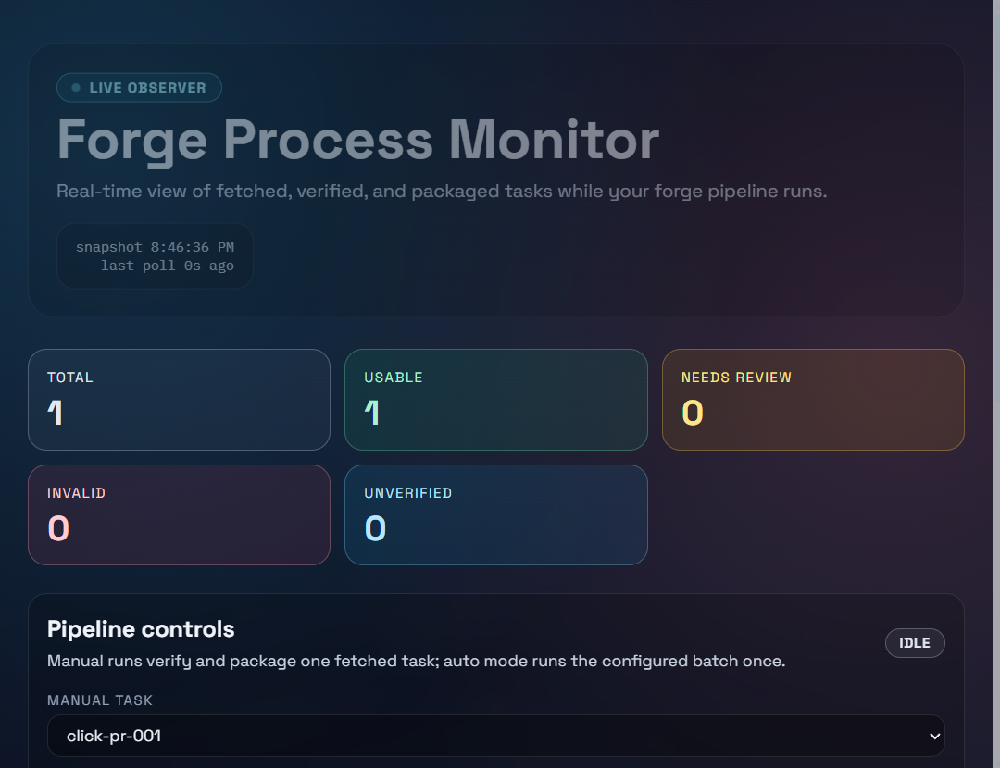
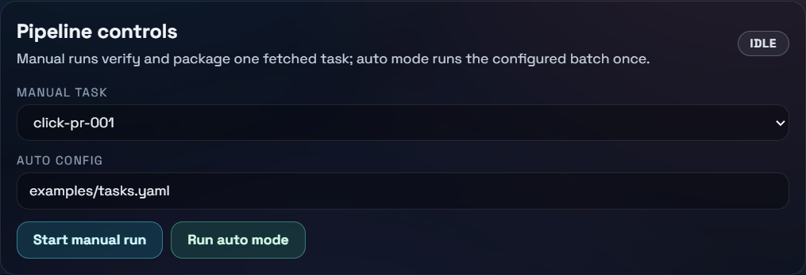
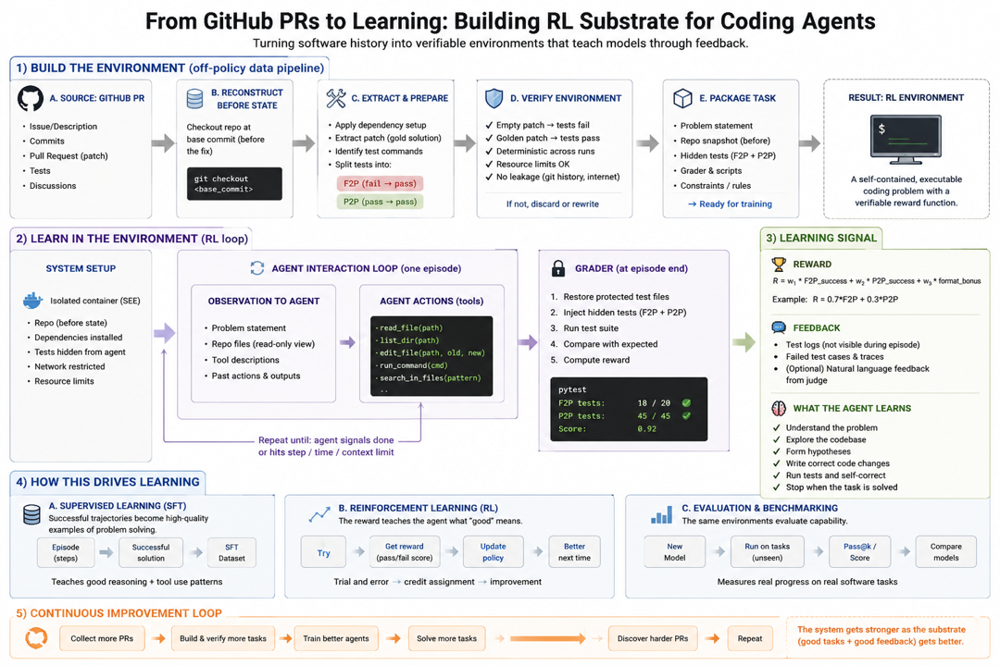

# swe-rl-forge-lite

Turn real bug-fix pull requests into reproducible, reward-bearing coding-agent tasks.

`swe-rl-forge-lite` is a local pipeline that converts a merged GitHub pull request into a self-contained, executable task unit. Given a repository URL and a PR number, it reconstructs the repository exactly as it looked *before* the fix, confirms the historical patch still applies, runs the project's tests both before and after the patch inside Docker, repeats the post-patch run to check for non-determinism, and packages everything into an inspectable `taskpacks/<task_id>/` folder. Each package ships with a prompt, the pre-fix repository snapshot, the known-good ("gold") patch, a Dockerfile, a standalone reward script, the full verification record, and a rule-based quality verdict.

The result is a *verifiable environment* rather than a static example diff: a prompt, a known repository state, a test command, a reproducible reward function, and a quality report. Those units can drive SWE-agent evaluation, reward design, curriculum building, and RL-style training loops where success must be grounded in executable evidence instead of human opinion or model preference.

The project is intentionally focused and fully local. There is no cloud dependency for the core pipeline. Dockerized runs and deterministic reruns reduce hidden environment drift, and a strict quality gate labels every task as `usable`, `needs_review`, or `invalid`, so weak or unreproducible tasks never silently contaminate a dataset. An optional, advisory LLM step can help triage which PRs are worth verifying, but it never decides reward or validity — `forge verify` remains the only source of truth.

## What You Can Do With It

- Build a small benchmark from real merged PRs instead of synthetic bugs.
- Check whether a historical fix is actually test-verifiable before packaging it.
- Generate self-contained `taskpacks/<task_id>/` folders with prompts, patches, Dockerfiles, verification metadata, and reward scripts.
- Run a binary reward against a packaged task to score an agent's attempted fix.
- Watch the pipeline live while tasks move from fetched to verified to packaged.

## How It Works

The pipeline is a small set of composable commands, each writing inspectable artifacts to disk so any stage can be re-run or audited independently.

```text
  explore            fetch                verify                  package            reward / report
  (optional)         clone repo @ base    docker test BEFORE      taskpack/<id>/     binary score +
  rank PR            + PR metadata        apply gold patch        prompt, repo,      quality verdict
  candidates  ─────▶ + gold.patch  ─────▶ docker test AFTER ────▶ Dockerfile,  ────▶ usable /
                                          deterministic rerun     reward.py,         needs_review /
                                          quality gate            verification       invalid
```

1. **Explore (optional).** Search public GitHub PRs heuristically for likely bug-fix candidates and emit a YAML config. An optional LLM pass can rerank them, but it stays advisory.
2. **Fetch.** Clone the repository, download PR metadata from the public GitHub API, resolve the base and head commits, and save the ground-truth `gold.patch` under `.forge/tasks/<task_id>/`.
3. **Verify.** Check out the base commit, confirm the gold patch applies, run the configured test command in Docker *before* the patch (expecting failure), apply the patch and run again (expecting success), then run a second post-patch pass to catch non-deterministic tests. Infrastructure failures (e.g. Docker build or missing test tooling) are recorded separately from product behavior.
4. **Package.** Emit a portable `taskpacks/<task_id>/` folder containing the prompt, the pre-fix repository snapshot, the gold patch, a generated Dockerfile, a standalone `reward.py`, and the verification record.
5. **Reward & Report.** Score an agent's candidate fix with a binary, test-based reward, and print a compact quality report with the recommended status.
6. **Observe.** A static or live dashboard surfaces task status, quality checks, packaging state, and a searchable training-package inventory while the pipeline runs.

## Fast Local Demo

The repo ships with one sample task, `click-pr-001`, so you can exercise the pipeline without finding a new PR first.

```bash
pip install -e ".[dev]"
forge fetch examples/tasks.yaml
forge verify click-pr-001
forge package click-pr-001
forge dashboard-live --enable-controls --open
```

On Windows, `./start.ps1` opens the live React dashboard in a separate terminal, starts Docker Desktop if the Docker engine is not running, installs frontend dependencies if needed, and starts the local API with pipeline controls enabled.

## Live Dashboard



The React dashboard is a near real-time observer of the pipeline. From top to bottom it shows:

- **Summary counters** for total, usable, needs-review, invalid, and unverified tasks.
- **Pipeline controls** (opt-in) with a streaming run log that traces each verification step — base checkout, patch application, before/after test runs, and the deterministic rerun.
- **Training package inventory**: a searchable table of emitted taskpacks with their quality verdict, complexity estimate, average patch size, average verification time, and bundled artifacts (`Dockerfile`, `gold.patch`, `prompt.md`, `repo/`, `reward.py`, `task.json`, `verification.json`).
- **Per-task quality cards** that break down every gate — base commit found, patch applies, tests fail before, tests pass after, deterministic rerun, Docker build, and test environment — alongside repository, pull-request, and packaging metadata.



Pipeline controls are opt-in on the CLI via `--enable-controls`. The server itself only runs named forge operations (`fetch`, `verify`, and `package`) against local task data — it never shells out to arbitrary commands on the host. A task's configured `test_command` is executed only inside the disposable, network-isolated Docker container, never on the host shell. Control endpoints additionally accept requests only from loopback (localhost) origins, which blocks cross-site and DNS-rebinding abuse from a page you happen to be visiting. By default the dashboard is read-only and refresh-safe.

## Project Flow



## Why This Matters

LLM training and evaluation for software engineering need environments where success is grounded in executable evidence. A useful task should answer a few hard questions:

- Can we reconstruct the repository before the fix?
- Does the historical patch apply cleanly?
- Do tests fail before the patch?
- Do tests pass after the patch?
- Can another runner reproduce the reward without hidden state?

When those pieces are available, a pull request becomes more than an example diff. It becomes a verifiable environment: a prompt, a repository state, a known-good patch, a test command, a reward function, and a quality report. That is the unit this project is designed to produce.

## Why Trust The Task?

`swe-rl-forge-lite` treats quality as an executable gate, not a heuristic score.

For each candidate task, `forge verify` checks:

- The repository can be reconstructed at the historical base commit.
- The historical gold patch applies cleanly on that base commit.
- Tests fail before the patch.
- Tests pass after the patch.
- A deterministic post-patch rerun also passes (it re-runs the patched tree in a freshly built image to catch post-patch flakiness; it does not re-check the pre-patch baseline).
- Docker builds and the test environment are healthy.

The verifier also distinguishes product behavior from infrastructure failures (for example, missing test tooling or Docker build issues), and records those separately in verification output.

The final quality recommendation is rule-based:

- `invalid`: foundational checks fail (base commit, patch applicability, Docker build, or test environment).
- `usable`: tests fail before, pass after, and deterministic rerun passes.
- `needs_review`: everything else.

This keeps the source of truth grounded in reproducible execution rather than metadata, intuition, or LLM opinion.

Every report keeps the failure reason visible. A task can fail because the base commit cannot be reconstructed, the patch does not apply, Docker cannot build the environment, the pre-patch tests do not fail, the post-patch tests do not pass, or the deterministic rerun drifts. Those distinctions matter when deciding whether a task belongs in an evaluation set.

## Features

- Ingest public GitHub pull requests without requiring a GitHub token.
- Clone and reconstruct the repository at the PR base commit.
- Save PR metadata and the ground-truth patch.
- Run pre-patch and post-patch tests in Docker.
- Package tasks into self-contained `taskpacks/<task_id>/` folders.
- Generate a standalone `reward.py` script with binary test-based reward.
- Print a task quality report with a recommended status.
- Explore public GitHub PRs and emit candidate task YAML for verification.
- Generate a local static dashboard for observing task status and verification results.
- Run a live dashboard API and React UI for near real-time process observation.

## Installation

Python 3.11+ and Docker are required for verification and reward execution.

```bash
pip install -e .
```

For local development:

```bash
pip install -e ".[dev]"
pytest
```

Check the CLI:

```bash
forge --help
```

The public GitHub API works without a token for light usage. For longer exploration sessions, set `GITHUB_TOKEN` or `GH_TOKEN` in your terminal to raise the rate limit. Tokens are optional and should not be committed.

## Quickstart

Edit `examples/tasks.yaml` or create your own config:

```yaml
tasks:
  - id: click-pr-001
    repo_url: "https://github.com/pallets/click.git"
    pr_number: 1
    base_ref: null
    test_command: "pytest"
    language: "python"
    timeout_seconds: 300
```

Fetch the task data:

```bash
forge fetch examples/tasks.yaml
```

Verify the historical patch:

```bash
forge verify click-pr-001
```

Package the task:

```bash
forge package click-pr-001
```

Run the reward:

```bash
forge reward taskpacks/click-pr-001
```

The reward command prints JSON:

```json
{
  "score": 0.0,
  "tests_passed": false,
  "error": "Test command exited with code 1"
}
```

Generate the quality report:

```bash
forge report click-pr-001
```

Generate a local dashboard:

```bash
forge dashboard
```

Open `.forge/dashboard/index.html` in a browser to inspect fetched, verified, packaged, usable, needs-review, and invalid tasks.

Run the live dashboard API server:

```bash
forge dashboard-live --open
```

Enable local run controls when you want the browser UI to launch verification and packaging jobs:

```bash
forge dashboard-live --enable-controls --open
```

Build and serve the React + Vite + Tailwind frontend through the same server:

```bash
npm --prefix frontend install
npm --prefix frontend run build
forge dashboard-live --open
```

For frontend development with hot reload:

```bash
forge dashboard-live --enable-controls
npm --prefix frontend run dev
```

Then open `http://127.0.0.1:5173`.

If the API server is on a non-default port, point the Vite proxy at it before starting the dev server:

```powershell
$env:FORGE_API_ORIGIN="http://127.0.0.1:8766"
npm --prefix frontend run dev
```

For control buttons during frontend development, start the API with `forge dashboard-live --enable-controls` and set `FORGE_API_ORIGIN` to that server.

On Windows, `./start.ps1` runs this local development setup in a separate terminal and starts Docker Desktop first if the Docker engine is not running.

You can also run the local demo script:

```powershell
./scripts/demo.ps1
```

On macOS or Linux:

```bash
sh scripts/demo.sh
```

The current sample is useful for CLI smoke testing, but it may report `needs_review` rather than `usable` because historical dependency and test behavior can drift. Replace `examples/tasks.yaml` with a known-good PR task once one verifies cleanly.

## CLI Commands

### `forge explore`

Searches public GitHub pull requests for likely task candidates. The explorer is intentionally heuristic: it finds merged Python PRs with bug/fix/test signals, ranks them, and can write a YAML config for the normal `fetch -> verify -> package -> report` pipeline.

```bash
forge explore --limit 10 --output .forge/candidates.yaml
```

Useful options:

- `--query "is:pr is:merged language:Python pytest regression"` to control GitHub search (the default when omitted is `is:pr is:merged language:Python pytest fix`).
- `--test-command "pytest"` to set the generated task command.
- `--timeout-seconds 300` to set the generated timeout.

Exploration does not prove a task is usable. It narrows the search space; `forge verify` remains the gate that checks patch application, failing pre-patch tests, passing post-patch tests, Docker build success, and deterministic reruns.

#### Default Candidate Scoring

Each candidate is assigned a score between 0 and 1 based on the following heuristics, derived directly from the PR metadata:

| Criterion | Score impact | What it checks | Why it matters |
|---|---|---|---|
| Merged PR | `+0.15` | PR was merged into the project | Weak quality signal. Maintainers likely reviewed and accepted the change. |
| Bug/fix language | `+0.25` | Title/body contains words like `bug`, `fix`, `regression`, `failure`, `failing`, `broken` | Suggests the PR fixed a real defect, not just changed code. |
| Test signal | `+0.20` | Title/body contains words like `test`, `pytest`, `unit test`, `regression test` | Increases chance that the task can be verified through executable tests. |
| Small changed-file count | `+0.15` | PR changes 1 to 8 files | Keeps the task focused and easier to isolate. |
| Large changed-file count | `-0.15` | PR changes more than 20 files | Large PRs are often noisy: refactors, migrations, generated code, or many unrelated changes. |
| Moderate patch size | `+0.15` | Additions + deletions are between 1 and 500 lines | Indicates the fix is meaningful but still manageable. |
| Large patch size | `-0.20` | Additions + deletions exceed 1500 lines | Too large for a clean SWE-agent task. Hard to attribute success to one focused fix. |
| Documentation-only risk | `-0.15` | Title/body contains `docs`, `documentation`, `typo`, or `readme` | These PRs often lack failing tests and are weak for reward-based learning. |

Scores are clamped to `[0.0, 1.0]`. Candidates are sorted by score descending before the `--limit` is applied. The score is advisory: a high score improves the odds of a task passing `forge verify`, but it is not a guarantee.

An LLM can be useful in this discovery loop, but it should stay advisory. Good uses include reading PR titles/bodies/diffs to prioritize candidates, spotting likely documentation-only changes, suggesting a narrower test command, and explaining why a candidate may fail verification. The source of truth remains executable verification: patch application, Docker build, tests before/after, and deterministic reruns. To keep the MVP local and reproducible, `forge explore` does not require an LLM or any cloud service.

#### Optional LLM-Assisted Candidate Review

`forge explore` can optionally ask an LLM to review and rerank candidates after the normal GitHub heuristic search. This is useful when exploration returns many plausible PRs and you want to spend Docker verification time on the best few.

The LLM is advisory only. It never decides reward, task validity, or pass/fail status. `forge verify` remains the source of truth.

1. Copy the example environment file:

```bash
cp .env.example .env
```

2. Configure exactly one provider.

For Azure OpenAI:

```bash
AZURE_OPENAI_ENDPOINT=https://your-resource.openai.azure.com
AZURE_OPENAI_DEPLOYMENT=your-deployment-name
AZURE_OPENAI_API_KEY=your-api-key
AZURE_OPENAI_API_VERSION=2024-10-21
```

For Gemini:

```bash
GEMINI_API_KEY=your-api-key
GEMINI_MODEL=gemini-1.5-flash
```

3. Validate the local configuration without printing secrets:

```bash
forge llm-check --env-file .env
```

Use an explicit provider if needed:

```bash
forge llm-check --provider azure-openai --env-file .env
forge llm-check --provider gemini --env-file .env
```

4. Run exploration with LLM review:

```bash
forge explore \
  --query "is:pr is:merged language:Python pytest regression" \
  --limit 10 \
  --llm-review \
  --llm-provider auto \
  --env-file .env \
  --output .forge/candidates.yaml
```

Provider selection can be explicit:

```bash
forge explore --llm-review --llm-provider azure-openai --output .forge/candidates.yaml
forge explore --llm-review --llm-provider gemini --output .forge/candidates.yaml
```

5. Verify the candidates normally:

```bash
forge fetch .forge/candidates.yaml
forge verify <task_id>
forge report <task_id>
```

Keep `.env` local. It is already ignored by the repository template and should never be committed.

### `forge fetch <config.yaml>`

- Clones each repository into `.forge/repos/<task_id>`.
- Fetches pull request metadata from the public GitHub API.
- Identifies the base and head commits.
- Writes `.forge/tasks/<task_id>/metadata.json`.
- Writes `.forge/tasks/<task_id>/gold.patch`.

### `forge verify <task_id>`

- Checks out the base commit.
- Checks whether the gold patch applies cleanly.
- Runs the configured test command in Docker before the patch.
- Applies the gold patch.
- Runs the configured test command in Docker after the patch.
- Runs the post-patch command a second time as a deterministic rerun check.
- Writes `.forge/tasks/<task_id>/verification.json`.

### `forge package <task_id>`

Creates `taskpacks/<task_id>/` with:

- `task.json`
- `prompt.md`
- `gold.patch`
- `reward.py`
- `Dockerfile`
- `verification.json`
- `repo/` containing the base repository snapshot

The prompt includes the repository name, PR title, PR body, failing test command, and the instruction: "Modify the code so that the tests pass."

### `forge reward <taskpack_path>`

Runs the taskpack's standalone reward script and returns JSON:

```json
{
  "score": 1.0,
  "tests_passed": true,
  "error": null
}
```

For v1, the reward is binary:

- `1.0` if the configured test command exits with code `0`
- `0.0` otherwise

`error` is `null` on success. On a plain test failure it carries `"Test command exited with code <n>"`; on an infrastructure failure (missing artifacts, Docker build failure, or timeout) it carries the corresponding message.

### `forge report <task_id>`

Prints a compact quality report:

- base commit found
- patch applies cleanly
- tests fail before patch
- tests pass after patch
- deterministic rerun status
- environment build status
- recommended status: `usable`, `needs_review`, or `invalid`

### `forge dashboard`

Generates a self-contained local HTML dashboard from `.forge/tasks/*` artifacts:

```bash
forge dashboard --output .forge/dashboard/index.html
```

The dashboard is observational only. It reads metadata, verification results, patch presence, and taskpack presence, then renders summary counts, filters, quality checks, and recorded errors. It does not run tests or mutate repositories.

### `forge dashboard-live`

Starts a local HTTP server with a live JSON endpoint and optional static frontend hosting:

```bash
forge dashboard-live --host 127.0.0.1 --port 8765
```

- `GET /api/tasks` returns a snapshot with task rows and summary counters.
- `GET /api/control/status` returns whether run controls are enabled and the latest control job.
- `GET /health` returns a basic health payload.
- If `frontend/dist` exists, the command also serves the React dashboard UI.

By default, the live dashboard is read-only and refresh-safe. It continuously reflects current `.forge/tasks/*` and `taskpacks/*` artifacts without mutating task state.

Run controls are available only when the server is started with `--enable-controls`:

```bash
forge dashboard-live --enable-controls
```

With controls enabled:

- `POST /api/control/manual` verifies and packages one already-fetched task from a JSON body like `{"task_id":"click-pr-001"}`.
- `POST /api/control/auto` runs a one-shot `fetch -> verify -> package` batch from a config body like `{"config_path":"examples/tasks.yaml"}`.
- Auto mode exposes a run queue in the live dashboard so each configured repo/PR can be tracked as queued, running, packaged, skipped, or failed.
- Only one control job can run at a time.
- Invalid verification results are not packaged.

Controls deliberately run named forge operations rather than arbitrary host shell commands; the task `test_command` runs only inside the Docker container. Control endpoints accept requests only from loopback origins. Auto mode is a bounded batch run, not a continuous scheduler.

## Docker Execution

Generated task Dockerfiles use `python:3.11-slim`. The image always upgrades `pip` and installs `pytest`, then installs the project with the **first** rule that matches:

1. `pip install -e .` if `pyproject.toml`, `setup.py`, or `setup.cfg` exists, otherwise
2. `pip install -r requirements.txt` if `requirements.txt` exists, otherwise
3. no project install step.

The configured test command runs inside the container with a timeout, with no network access and bounded resources (`--network none`, `--memory`, `--cpus`, `--pids-limit`, `--security-opt no-new-privileges`). Tests that need network access at run time will therefore fail — this is intentional, since network-dependent tests are not reproducible. Docker is deliberately local-only; there is no cloud dependency.

## Current Limitations

- Python-only Dockerfile generation.
- No hidden tests or leakage detection.
- No agent rollout orchestration.
- No model training, GRPO, LoRA, or fine-tuning pipeline.
- Public GitHub API rate limits apply when unauthenticated.
- Historical repositories can have old dependency constraints that no longer install cleanly.
- Exploration is heuristic and can surface PRs that are documentation-only, flaky, or not reproducible.
- Test determinism is approximated by a second post-patch run in the same generated environment.

## Roadmap

- Add language-specific runners beyond Python.
- Add dependency lockfile capture for stronger reproducibility.
- Add taskpack manifests for dataset indexing.
- Add optional GitHub token support for higher API limits.
- Add richer quality scoring and flakiness diagnostics.
- Add batch task generation and filtering.
- Add deeper repository probing for explorer candidates before verification.
- Add optional LLM-assisted candidate review behind an explicit user-provided provider or local model.
- Add hooks for agent rollout systems while keeping reward execution independent.

## Design Principle

This project is not just a benchmark wrapper. The useful unit is a reproducible environment with task creation, verification, reward, quality reporting, and packaging. That unit can later plug into small-scale training loops, curriculum builders, or evaluation harnesses, but the MVP keeps the center of gravity on correctness and reproducibility.